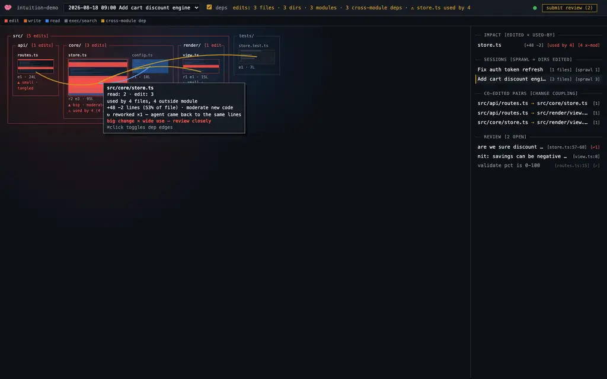

# intuition

Where omp agents touched a codebase, down to the line — and a review loop to
steer them.

intuition mines omp session files (`~/.omp/agent/sessions`) for every
file-touching tool call and renders a live dashboard: nested directory frames,
per-file minimaps with touched line ranges, dependency edges, blast radius,
change-size/complexity verdicts, and side-by-side diffs vs git HEAD. In live
mode you leave inline review comments, submit the review, and the agent that
did the work addresses every comment.



## Requirements

- [bun](https://bun.sh)
- [omp](https://github.com/oh-my-pi/pi-coding-agent) — sessions to mine, and
  the agent that addresses reviews
- git (optional; enables durable diffs vs HEAD)

## Quickstart

```sh
# one-shot static report for the repo in cwd
bun intuition.ts . -o report.html

# live dashboard (defaults to port 4747)
bun intuition.ts . --live -p 4747
# → http://localhost:4747/intuition
```

## Install as an omp plugin (recommended)

The extension keeps a dashboard running for every repo you work in and routes
submitted reviews into your live omp session:

```sh
git clone <this repo> ~/code/intuition
cp ~/code/intuition/extension.ts ~/.omp/agent/extensions/intuition.ts
```

If the repo lives somewhere other than `~/code/intuition`, set
`INTUITION_SCRIPT=/path/to/intuition.ts` in your environment.

What the plugin does:

- after every agent turn, silently ensures a live dashboard is serving the
  repo (stable per-repo port derived from the cwd, starting at 4700)
- adds a `/intuition` command in omp that opens the dashboard in your browser
- watches `<repo>/.intuition/notes.jsonl` for **submitted** review rounds and
  wakes your live session to address them

Remove `~/.omp/agent/extensions/intuition.ts` to uninstall.

## Review flow

1. Open a file in the dashboard, click a line number (or drag across several)
   and leave a comment. Comments are tagged with the session under review.
2. Comments accumulate — nothing edits the repo yet. In the background a
   read-only agent (`omp -p --tools=read,grep,glob`) drafts an investigation
   brief into `.intuition/investigation.md`.
   Investigation starts as soon as a comment lands (comments under
   investigation pulse `◐ investigating`); open questions get a small
   investigator note on the thread. Edits only ever start at submit.
3. Hit **submit review** in the header. Your live omp session claims the round
   and addresses each comment (the plugin injects it as a prompt). If no live
   session claims it within ~25s, the server falls back to a headless agent
   that resumes the exact session under review (`omp -p -r <session-id>`).
4. The agent replies to each comment in the dashboard. Resolving comments is
   yours alone — use the resolve link on a thread.

Keyboard: hover a file window and hit `c` for a whole-file comment; hover a
code line and hit `c` for a line comment; hover a thread and hit `r` to
resolve/reopen. Drag along the line-number gutter to comment on a range;
⌘-click a file window to mute its dependency edges.

Everything is journaled to `.intuition/notes.jsonl` (gitignored), one JSON
record per line: comments, replies, resolves, submits, and round acks. No
external review tool is involved.

## Notes

- The live server serves the report at `/intuition` only; `/` redirects.
- `/intuition/new` restarts the server for a fresh instance.
- The server re-execs itself when `intuition.ts` changes, and connected
  dashboards reload automatically.
- Untitled sessions (headless agent runs) are excluded from the dashboard.
